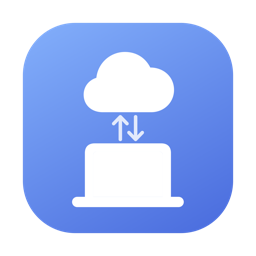
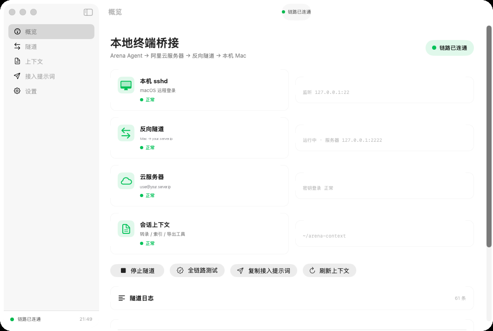
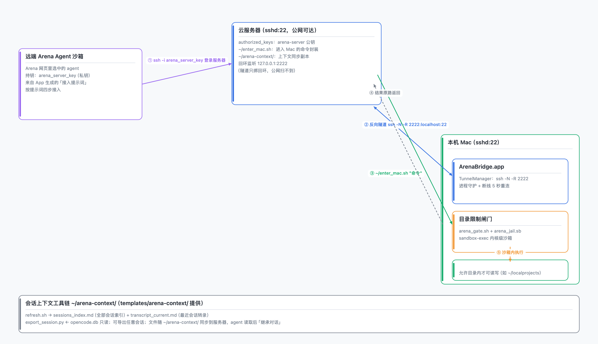
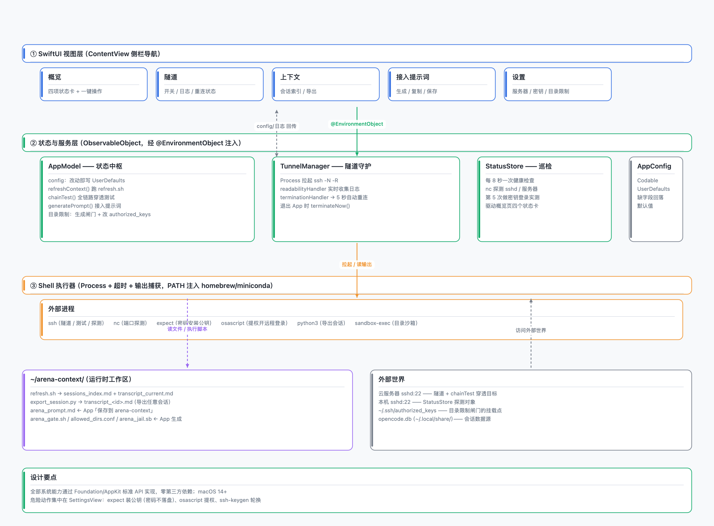

# ArenaBridge



**把远端 AI Agent 接进你的本地终端。** 原生 macOS App（SwiftUI），把「远端 Agent → 云服务器 → 反向隧道 → 本机 Mac」整条链路装进一个界面。

ArenaBridge 在你的 Mac 上维持一条到云服务器的反向 SSH 隧道：远端 agent 通过服务器进入你的本地终端，像本地 agent 一样读写文件、执行命令；本地会话上下文（opencode 会话转录）也会同步过去，实现"继承对话"。



## 功能

| 页面 | 说明 |
| --- | --- |
| 概览 | 四项状态卡片（本机 sshd / 反向隧道 / 云服务器 / 会话上下文）；一键启动停止隧道、全链路测试、打开 Arena、复制接入提示词、刷新上下文 |
| 隧道 | 隧道开关（断线 5 秒自动重连）、运行时长、实时日志控制台（自动滚动） |
| 上下文 | 列出 `~/arena-context/sessions_index.md` 中的全部会话；重新导出；导出任意会话并在访达中显示 |
| 接入提示词 | 按服务器配置 + `~/.ssh/arena_server_key` 自动生成发给远端 agent 的接入指令，可复制 / 保存 |
| 设置 | 服务器地址 / 用户 / 端口；密码安装公钥（不保存密码）；一键开启本机远程登录；重新生成接入密钥；**Arena 目录限制**（限制远端 agent 只能在指定目录工作）；Arena 网址；启动时自动开隧道 |

## 工作原理

```
远端 Agent 沙箱 ──ssh──► 云服务器 (sshd:22)
                            │  127.0.0.1:2222
                            ▲ 反向隧道（App 维持 ssh -N -R）
                            │
                        本机 Mac (sshd:22)
```

- **隧道**：`ssh -N -R 2222:localhost:22 user@server`，由 App 拉起并守护，断线 5 秒自动重连；隧道只绑服务器 `127.0.0.1`，公网扫不到。
- **服务器侧**：`~/enter_mac.sh` 封装了「从服务器进入 Mac」的命令，远端 agent 直接调用。
- **上下文**：`~/arena-context/`（transcript / sessions_index / export_session.py / arena_prompt.md），并同步一份到服务器。

## 架构

**全链路拓扑**（`docs/architecture_topology.png`，`swift make_arch.swift` 可重新生成）：



**App 内部架构**（`docs/architecture_app.png`）——视图层 → 状态服务层 → Shell 执行器 → 外部进程/文件，单向数据流：



## 会话上下文工具链

`~/arena-context/` 里的 `refresh.sh` / `export_session.py` 由本仓库 `templates/arena-context/` 提供（从 opencode 本地数据库 `~/.local/share/opencode/opencode.db` 只读生成 `sessions_index.md` 与 `transcript_current.md`）。概览页「会话上下文」变红 = 这两个文件缺失，任选其一恢复：

```bash
# 方式一：从仓库模板部署（缺什么补什么，不影响已有文件）
mkdir -p ~/arena-context && cp -Rn templates/arena-context/. ~/arena-context/ && bash ~/arena-context/refresh.sh
```

或在 App 里点「刷新上下文」/上下文页「重新导出会话」（前提是 `refresh.sh` 已存在）。换机器时 opencode 数据库路径不同的话，改 `export_session.py` 顶部的 `DB` 常量即可。

> 注意：转录会原样包含你会话里的内容——粘贴过的密钥、token 都会写进 `transcript_current.md` 并同步给远端 agent。分享前先检查，敏感凭据建议轮换。

## 目录限制（可选）

默认情况下，远端 agent 拥有你本机用户级别的完整 shell。开启「设置 → Arena 目录限制」后可以把它的活动范围锁死：

1. 打开开关，用「添加目录…」选择一个或多个允许目录（多选，可后续增删）。
2. App 会自动生成 `~/arena-context/arena_gate.sh`（闸门脚本）、`allowed_dirs.conf`（允许清单）和 `arena_jail.sb`（sandbox-exec profile），并通过 `~/.ssh/authorized_keys` 的 `command=` 把**服务器进入 Mac 的那把钥匙**（`arena_mac_key`，设置页可改路径）固定到闸门脚本上。
3. 之后 arena 经服务器进入本机的每条命令都会先经过闸门，由 macOS `sandbox-exec` 强制限制：
   - 允许目录：完整读写；`~/arena-context`（会话上下文）始终可读写；`/tmp` 可作临时目录
   - 主目录其他位置：默认**读写都拒绝**（关闭「严格模式」后变为只读）
   - `~/.ssh`、`~/.gnupg`、`~/.aws`、`~/.config`、钥匙串等敏感位置与系统目录：一律禁止
   - 工具链（miniconda3 / cargo / nvm / pyenv / go 等）与系统运行时只读放行，保证编译、git 等能正常用
4. 允许目录之外的文件会被内核拒绝，`cd` 出去也落不了地；越界访问会返回 `Operation not permitted`。
5. 生成了新的接入提示词里也会带上「目录限制」段落，agent 一拿到提示就知道边界。
6. 关闭开关即刻恢复原状：App 自动把 `authorized_keys` 还原为普通公钥行（其他行原样保留）。

> 说明：限制发生在本机侧（kernel 沙箱），与服务器无关；即使服务器被入侵也绕不过这把闸。若系统缺少 `sandbox-exec`，闸门会退化为命令级路径校验并明确告警（强度低于沙箱，仅兜底）。

## 快速开始

1. 准备一台有公网 IP 的 Linux 服务器（Ubuntu 测试通过）；本机 macOS 14+。
2. 构建并运行：

   ```bash
   ./build.sh
   open build/ArenaBridge.app
   ```

3. 首次配置（设置页）：
   - 填服务器地址 / 用户名 / 端口 → 输入密码点「安装公钥」
   - 点「开启远程登录」授权本机 sshd（首次会弹管理员密码框）
   - 确认概览页四项状态全绿（「会话上下文」异常时按下方「会话上下文工具链」恢复）
4. 在远端 agent 的会话里粘贴「接入提示词」（概览页一键复制）。
5. 点「全链路测试」验证：命令会从服务器穿透到本机执行并原路返回。

> 提示：Mac 休眠会断开隧道，长任务建议接电源并开启防休眠；退出 App 会同时断开隧道。

## 构建环境

- macOS 14+，Xcode Command Line Tools（无需完整 Xcode）
- `swift build` 编译；`build.sh` 负责组装 `.app`、生成图标、ad-hoc 签名

## 安全须知

- 这套方案本质是把本机 shell 交给远端 agent：只连接你信任的 agent / 服务，破坏性操作请先确认。
- 接入密钥（`~/.ssh/arena_server_key`）等同服务器密码，泄露后立即轮换；永远不要提交到任何仓库。
- 建议开启「Arena 目录限制」，把远端 agent 锁在指定目录内（见上文），并定期检查服务器登录日志。
- 建议为远端接入使用专用密钥 / 专用账号，并定期检查服务器登录日志。

## 目录结构

```
templates/arena-context/
├── refresh.sh          # 重生成 sessions_index.md + transcript_current.md
├── export_session.py   # 从 opencode 数据库导出任意会话转录
└── README.md           # 上下文工作区说明

Sources/ArenaBridge/
├── App.swift            # @main：窗口与依赖注入
├── AppModel.swift       # 全局状态：配置、上下文导出、全链路测试、提示词生成
├── Config.swift         # AppConfig（UserDefaults 持久化）
├── Shell.swift          # 进程执行（超时 / 输出捕获）
├── TunnelManager.swift  # 反向隧道进程 + 日志 + 自动重连
├── StatusStore.swift    # 定时健康检查（sshd / 服务器 / 密钥 / 上下文）
└── Views/               # 概览 / 隧道 / 上下文 / 提示词 / 设置
```

## License

MIT
